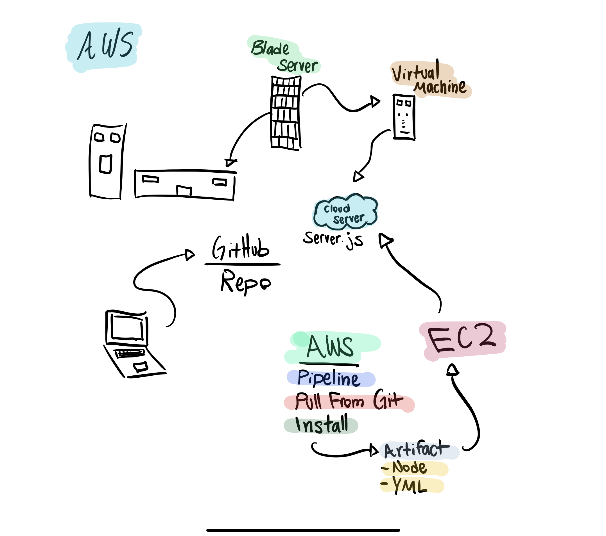

# LAB - 

## Project Name

### Author: Student/Group Name

### Links and Resources
* [submission PR](http://xyz.com)
* [back-end(AWS)](http://socketserver-env.h4y5tx6t6s.us-east-2.elasticbeanstalk.com/)

#### Running the app
* `node app.js`
  * can talk through terminal
* `node console.js`
  * consoles and no body cares from server on AWS.

#### UML

